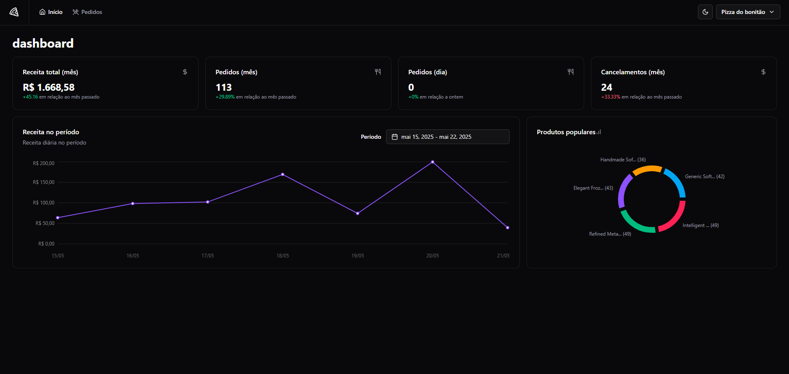

# 🍕 Pizza Shop

Um sistema completo de gerenciamento de pizzaria, composto por uma API REST e uma interface web moderna, utilizando Docker para o banco de dados PostgreSQL.



#### Observação

Este projeto foi desenvolvido durante o curso de React.js da Rocketseat, onde o frontend foi implementado como parte dos exercícios práticos do curso, enquanto o backend foi fornecido pelo instrutor como base para o desenvolvimento.

## 📋 Visão Geral

O Pizza Shop é um sistema completo para gerenciamento de pizzarias, oferecendo funcionalidades tanto para clientes quanto para administradores. O projeto é dividido em duas partes principais:

- **API (pizzashop-api)**: Backend em Node.js com TypeScript usando Bun e PostgreSQL em Docker
- **Web (pizzashop-web)**: Frontend em React com TypeScript usando pnpm

## 🚀 Tecnologias Utilizadas

### Backend (API)

- Node.js
- Bun (Runtime e gerenciador de pacotes)
- TypeScript
- Drizzle ORM
- PostgreSQL
- Docker

### Frontend (Web)

- React
- TypeScript
- Vite
- Tailwind CSS
- Shadcn UI
- pnpm (Gerenciador de pacotes)

## 🛠️ Pré-requisitos

- Node.js (versão LTS)
- Bun (para o backend)
- pnpm (para o frontend)
- Docker e Docker Compose
- PostgreSQL (se não estiver usando Docker)

## 🏗️ Estrutura do Projeto

```
pizza-shop/
├── pizzashop-api/     # Backend da aplicação
└── pizzashop-web/     # Frontend da aplicação
```

## 🚀 Como Executar

### Backend (API)

1. Entre no diretório da API:

```bash
cd pizzashop-api
```

2. Instale as dependências:

```bash
bun i
```

3. Inicie o PostgreSQL usando Docker:

```bash
docker-compose up -d
```

4. Execute as migrações do banco de dados:

```bash
bun migrate
```

5. Popule o banco de dados com dados iniciais:

```bash
bun seed
```

6. Inicie o servidor de desenvolvimento:

```bash
bun dev
```

### Frontend (Web)

1. Entre no diretório web:

```bash
cd pizzashop-web
```

2. Instale as dependências:

```bash
pnpm install
```

3. Inicie o servidor de desenvolvimento:

```bash
pnpm dev
```
